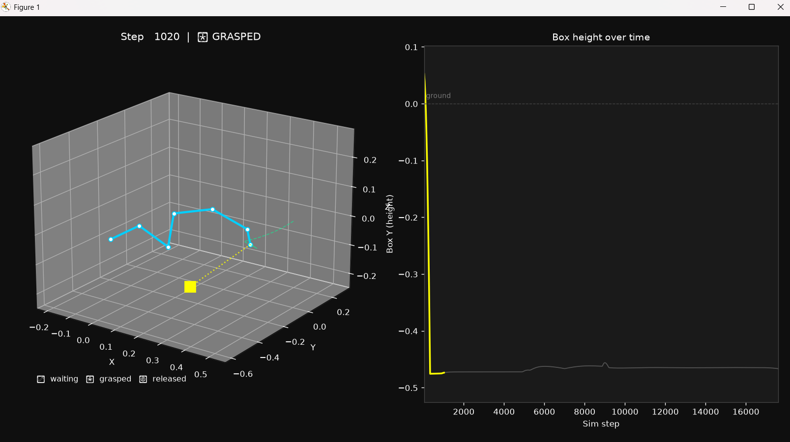

<div align="center">

# 🦾 DART Pick-and-Place

**A 6-DOF robotic arm simulation built with the DART physics engine.**  
Real articulated-body dynamics · Stable-PD joint control · Constraint-based grasping

[](https://python.org)
[](https://github.com/dartsim/dart)
[](LICENSE)
[](https://dartsim.github.io)

</div>

---

## 📽️ Demo

> **Left:** 3D stick-figure animation of the KR5 arm + grasped box (yellow = grasped, red = released)  
> **Right:** Box height over time — the rise at LIFT and fall at RELEASE are the grasp in action.



<details>
<summary><b>Terminal output (click to expand)</b></summary>

```
[step      0] -> HOME_TO_ABOVE_PICK
[step    530] -> DESCEND_TO_PICK
[step    822] -> GRASP
[step    872] -> LIFT
[step   4872] -> TRANSPORT
[step   8872] -> DESCEND_TO_PLACE
[step  12872] -> RELEASE
[step  16921] -> RETREAT
[step  17630] -> DONE
Final box position: [ 0.408  -0.467   0.054]
Task finished: True
```

</details>

---

## 🧠 What this actually demonstrates

This isn't scripted motion — the arm is controlled entirely through torques computed from the robot's own dynamics at every 1 ms timestep.

| Concept | Where in code | What DART API it uses |
|---|---|---|
| Articulated-body dynamics | `controller.py` | `getMassMatrix()`, `getCoriolisAndGravityForces()` |
| Stable-PD torque control | `controller.py` | Forward-integrated error + `setForces()` |
| URDF robot loading | `world_setup.py` | `dart.utils.DartLoader` |
| Runtime constraint grasping | `task.py` | `dart.constraint.WeldJointConstraint` |
| Finite-state task supervisor | `task.py` | 8-state FSM with timeout fallback |
| Free-floating rigid body | `world_setup.py` | `createFreeJointAndBodyNodePair()` |

### Why Stable-PD?

Standard discrete PD diverges fast at small timesteps with non-trivial gains. Stable-PD (Tan et al.) evaluates position error against where the system *will be* after one more timestep at current velocity, then adds mass-matrix feedforward so gains only correct residual error — not fight gravity from scratch every step:

```python
q_err   = q_target - (q + dq * dt)   # forward-integrated error
ddq_des = Kp @ q_err + Kd @ (-dq)
forces  = M @ ddq_des + C_and_g       # full dynamics feedforward
```

---

## 🗂️ Project structure

```
dart-pickplace/
├── pickplace/
│   ├── world_setup.py   # builds World: ground + KR5 arm + target box
│   ├── controller.py    # StablePDController — torque-level joint control
│   └── task.py          # 8-state pick-and-place FSM + grasp/release logic
├── data/urdf/KR5/       # KUKA KR5 URDF + STL meshes (from dartsim/dart)
├── assets/              # screenshots and demo images
├── main.py              # headless run — logs state transitions to terminal
├── visualize.py         # matplotlib 3D animation + box-height subplot
└── requirements.txt
```

---

## 🚀 Setup

**Requires Python 3.12** (dartpy only ships Windows wheels for 3.12).

```bash
git clone https://github.com/YOUR_USERNAME/dart-pickplace.git
cd dart-pickplace

# create and activate virtual environment
python -m venv venv
venv\Scripts\activate        # Windows
# source venv/bin/activate   # macOS/Linux

pip install -r requirements.txt
```

### Run headless
```bash
python main.py
```

### Run with 3D animation
```bash
python visualize.py
```

The animation window shows:
- 🔵 **Cyan stick figure** — the 7-link KR5 arm moving through waypoints
- 🟢 **Green dashed trail** — end-effector path drawn in real time
- ⬜ **Grey box** — waiting to be picked
- 🟡 **Yellow box + dotted connector** — box grasped and carried by the arm
- 🔴 **Red box** — released, resting on the ground

---

## 📐 How the task works

The arm follows an 8-state finite state machine. Each state drives to a joint-space waypoint using the torque controller, then triggers an action or advances:

```
HOME ──► ABOVE_PICK ──► DESCEND ──► [GRASP] ──► LIFT
                                                   │
                                              TRANSPORT
                                                   │
                                          DESCEND_TO_PLACE
                                                   │
                                             [RELEASE]
                                                   │
                                              RETREAT ──► HOME
```

Grasping is implemented via `dart.constraint.WeldJointConstraint` — a runtime rigid constraint between the end-effector body node and the box, added to and removed from the world's constraint solver at the right state transitions.

---

## ⚠️ Known limitation (your next step)

Once the box is grasped, the controller's feedforward only accounts for the **arm's own** mass matrix — not the box hanging off the wrist. This causes a steady-state tracking error during TRANSPORT, visible as a slow drift in the box height chart. Some states advance via a timeout fallback rather than true convergence.

The fix: project the box's weight through the end-effector Jacobian (`getJacobian()`) and add it to the feedforward term in `controller.py`. That's the natural next milestone, and directly parallels the feedforward-vs-true-system-dynamics problem from real torque-controlled arms.

---

## 🗺️ Roadmap

- [x] Stable-PD joint-space controller
- [x] URDF loading + constraint-based grasping
- [x] 8-state FSM pick-and-place task
- [x] Matplotlib 3D animation with grasp visualization
- [ ] Feedforward compensation for grasped-object weight
- [ ] IK-based waypoints (Cartesian target → joint angles via `dart.dynamics.InverseKinematics`)
- [ ] Second object / obstacle avoidance
- [ ] Extend to cooking-task motions (pour, stir, place on surface)

---

## 🙏 Credits

This project is built on **[DART — Dynamic Animation and Robotics Toolkit](https://github.com/dartsim/dart)** by the dartsim team.

> DART uses generalized coordinates for articulated rigid body systems and Featherstone's Articulated Body Algorithm for accurate, stable motion dynamics. It is research-grade, open-source, and the physics backbone of Gazebo.

- DART GitHub: [github.com/dartsim/dart](https://github.com/dartsim/dart)
- DART Docs: [dart.readthedocs.io](https://dart.readthedocs.io)
- Manipulator tutorial this builds on: [dartsim.github.io/tutorials_manipulator.html](https://dartsim.github.io/tutorials_manipulator.html)
- KR5 URDF model: from [dartsim/dart/data/urdf/KR5](https://github.com/dartsim/dart/tree/main/data/urdf/KR5), BSD 2-Clause license

---

## 📄 License

MIT — see [LICENSE](LICENSE).  
The KR5 URDF and meshes in `data/` are from the DART project and carry their original BSD 2-Clause license.
